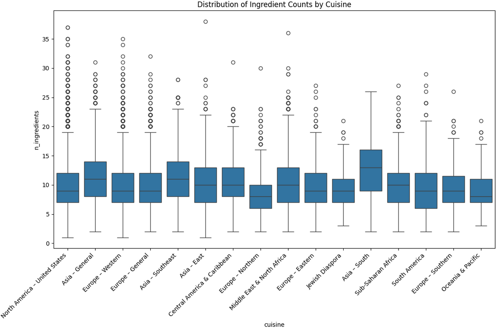
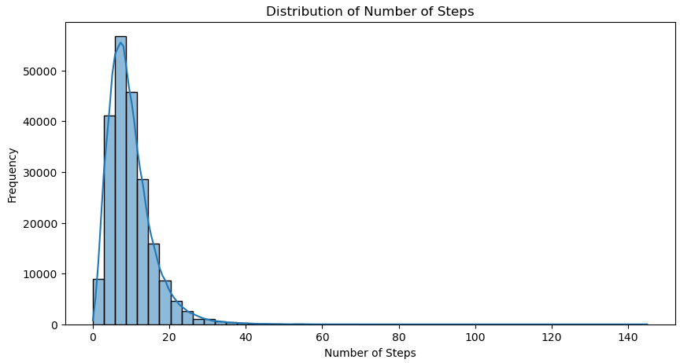
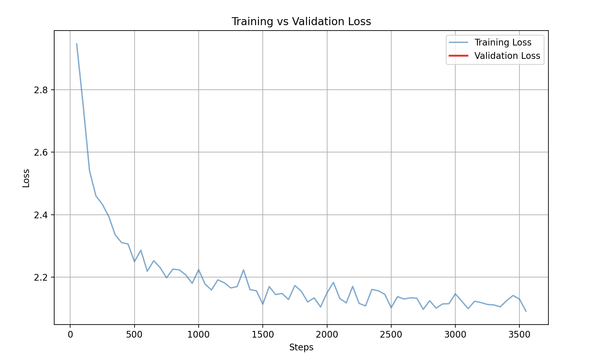

# Gusteau, The CookBro 👨‍🍳

<div align="center">
    
</div>

**Gusteau** is an NLP project that fine-tunes small language models to generate complete cooking recipes from dish names. We explore **parameter-efficient fine-tuning** (QLoRA, Prompt Tuning) and **inference-time techniques** (Outlines, DSPy) to transform a general-purpose 0.5B instruction model into a specialized culinary assistant.

---
## 👥 Contributors

This project was developed as part of an NLP course at EPITA.

**Team Members:**
- Angela SAADE
- Aurelien DAUDIN
- Baptiste ARNOLD
- Khaled MILLI
- Maxim Bocquillon

## Project Contributions

| Category | Task / Method | Contributor(s) | Notes |
| :--- | :--- | :--- | :--- |
| **EDA** | Exploratory Data Analysis | Maxim | |
| **Finetuning** | Lora / Qlora | Maxim | |
| | ia3 | Angela | |
| | Prompt tuning | Baptiste & Khaled | Pair-programming |
| **Evaluation** | LLM as a judge | Aurélien & Maxim | Pair-programming |
| | Bleu-Score | Baptiste & Khaled | Pair-programming |
| | Similarity | Baptiste & Khaled| Pair-programming |

---

## 📖 Table of Contents

1. [Introduction](#-introduction)
2. [Dataset & EDA](#-dataset--exploratory-data-analysis)
3. [Preprocessing Pipeline](#-preprocessing-pipeline)
4. [Fine-Tuning Methods](#-fine-tuning-methods)
5. [Inference Enhancement Techniques](#-inference-enhancement-techniques)
6. [Evaluation Methodology](#️-evaluation-methodology)
7. [Results & Analysis](#-results--analysis)
8. [Usage & Setup](#-usage--setup)
9. [Project Architecture](#️-project-architecture)

---

## 🎯 Introduction

### Project Motivation

Small language models (<1B parameters) are increasingly valuable for:
- **Edge deployment** (mobile devices, embedded systems)
- **Privacy-sensitive applications** (on-device inference)
- **Resource-constrained environments** (limited GPU/memory)

This project demonstrates that even a **0.5B parameter model** can learn specialized tasks when properly fine-tuned and evaluated with domain-specific metrics.

### Core Objectives

1. **Fine-Tune Qwen-2.5-0.5B-Instruct** to generate structured recipes (Ingredients + Instructions)
2. **Compare parameter-efficient methods:**
   - QLoRA: 50M trainable parameters (0.01% of model)
   - Prompt Tuning: 6.4K parameters (0.0013% of model)
3. **Evaluate rigorously** with both NLP metrics (BLEU, Similarity) and culinary validators
4. **Explore inference techniques** (constrained generation, prompt optimization)

### Key Challenge: Prompt Format Alignment

A critical lesson from this project: **fine-tuning format must match evaluation format**. Our initial QLoRA used ChatML format (`<|im_start|>user...`) while evaluation used custom format (`Instruction: ... Recipe:`), causing poor performance. This was fixed by standardizing on the custom format throughout.

---

## 📊 Dataset & Exploratory Data Analysis

### Dataset Source

We use the **Food.com Recipes Dataset**, a comprehensive collection of cooking recipes and user interactions.

| Attribute | Description |
|-----------|-------------|
| **Source** | [Kaggle - Food.com Dataset](https://www.kaggle.com/datasets/shuyangli94/food-com-recipes-and-user-interactions) |
| **Paper** | [https://arxiv.org/pdf/1909.00105](https://arxiv.org/pdf/1909.00105) |
| **Original Size** | 231K recipes |
| **Filtered Size** | 180K recipes (after preprocessing) |
| **Format** | CSV (converted to JSONL for training) |

**Download Options:**
1. **Automatic:** `main.py` downloads via Kaggle API (requires `~/.kaggle/kaggle.json`)
2. **Manual:** Download `RAW_recipes.csv` from Kaggle and place in `data/`

### Key Dataset Characteristics

**Attributes Used:**
- `name`: Dish title (e.g., "Classic Margherita Pizza")
- `ingredients`: List of ingredients (e.g., `['flour', 'tomato sauce', 'mozzarella']`)
- `steps`: Cooking instructions (list of steps)
- `nutrition`: Nutritional values (calories, protein, fat, etc.)
- `n_ingredients`: Number of ingredients
- `n_steps`: Number of cooking steps
- `minutes`: Preparation time

**Attributes Dropped:**
- Metadata: `contributor_id`, `submitted`, `tags`
- User interaction: `description` (often redundant or promotional)

### Exploratory Analysis

Before fine-tuning, we analyzed the dataset to understand:
- **Recipe complexity** (number of steps, ingredients)
- **Cuisine distribution** (Italian, Asian, American, etc.)
- **Nutritional patterns** (calorie ranges, protein/fat ratios)

| Analysis | Visualization |
|----------|---------------|
| **Ingredients by Cuisine** |  |
| **Recipe Steps Distribution** |  |

**Key Findings:**
- Most recipes have 7-12 ingredients
- Typical recipe length: 5-10 steps
- Preparation time: 15-60 minutes (after filtering outliers)

*(Full analysis available in `notebooks/EDA/`)*

---

## 🧪 Preprocessing Pipeline

Our preprocessing transforms raw CSV data into high-quality instruction-following training examples. This is critical for teaching the model recipe structure.

### 1. Filtering and Cleaning

**Outlier Removal:**
- Exclude recipes with `minutes >= 300` (5+ hours)
  - **Removed:** ~51K recipes (reduces dataset from 231K → 180K)
  - **Rationale:** Focus on standard home-cooking recipes

**Metadata Cleanup:**
- Drop non-content columns: `contributor_id`, `submitted`, `tags`
- Retain only: `name`, `ingredients`, `steps`, `nutrition`, `n_ingredients`, `n_steps`, `minutes`

### 2. Title Normalization

Recipe names often contain promotional text ("AMAZING!!!", "mom's secret", "you'll love this"). We normalize them to concise, canonical forms:

**Methodology:**
1. **Lemmatization:** `WordNetLemmatizer` normalizes words to base forms
2. **Stop-word Removal:** Removes "the", "a", "an", etc.
3. **Noise Filtering:** Excludes 400+ non-descriptive terms:
   - Emotional: "yummy", "delicious", "amazing"
   - Personal: "ashley", "grandma's", "mom's"
   - Redundant: "recipe", "dish", "food"

**Examples:**

| Original Title | Normalized Title |
|----------------|------------------|
| OH MY GOD ITS SO AMAZINGGGGG potatoes with chicken yummy yummy | potatoes with chicken |
| Grandma Ashley's Super Easy Best-Ever Chocolate Chip Cookies | chocolate chip cookies |
| The Most Delicious Italian-Style Pasta Carbonara Recipe | pasta carbonara |

### 3. Instruction and Ingredient Standardization

Unlike text classification, we **preserve full grammatical structure** for recipe generation.

**Unit Standardization (Metric System):**
- **Temperatures:** Fahrenheit → Celsius (rounded to integers)
  - Example: `350°F → 175°C`
- **Dimensions:** Inches → centimeters
- **Volume/Weight:** Standardized units (oz → grams, cups → mL)
- **Imprecise quantities:** Averaged
  - Example: `"2-3 cups"` → `"2.5 cups"`

**Ingredient Formatting:**
- Transform from structured lists → natural comma-separated strings
- Example: `['flour', 'sugar', 'eggs']` → `"flour, sugar, eggs"`

**Natural Language Preservation:**
- **No stemming** of instructions (preserve fluency)
- **No truncation** (keep full sentences)
- **Rationale:** LLM must learn to generate grammatically correct recipes

### 4. Supervised Fine-Tuning (SFT) Data Construction

We format the dataset as **Instruction-Output pairs** for supervised learning:

**Format:**
```
Input (Instruction): Create a detailed recipe for {dish_name}.
Output: Ingredients:\n{ingredients}\n\nInstructions:\n{steps}
```

**Example Training Sample:**
```
Input: Create a detailed recipe for Classic Margherita Pizza.

Output:
Ingredients:
pizza dough, tomato sauce, mozzarella cheese, fresh basil leaves, olive oil

Instructions:
1. Preheat oven to 220°C.
2. Roll out the pizza dough on a floured surface to 30cm diameter.
3. Spread tomato sauce evenly, leaving 2cm border.
4. Distribute mozzarella cheese over sauce.
5. Bake for 12-15 minutes until crust is golden and cheese bubbles.
6. Garnish with fresh basil leaves and drizzle olive oil before serving.
```

**Final Output:**
- **Format:** JSONL (`recipes_instructions.jsonl`)
- **Size:** 180K instruction-output pairs
- **Location:** `data/recipes_instructions.jsonl`

### 5. Nutritional Feature Extraction

Following recommendations from RecipeNLG [1], we expand the `nutrition` column into structured features:

**Extracted Features:**
- Calories
- Total fat (g)
- Sugar (g)
- Sodium (mg)
- Protein (g)
- Saturated fat (g)
- Carbohydrates (g)

**Usage:**
- Not used for text generation training
- Enables nutritional analysis and filtering
- Supports future multi-task learning (e.g., generating low-calorie recipes)

---

## 🧠 Fine-Tuning Methods

We explore two parameter-efficient fine-tuning (PEFT) techniques with drastically different resource requirements.

### 1. QLoRA (Quantized Low-Rank Adaptation)

**What is QLoRA?**
QLoRA enables fine-tuning large models on consumer hardware by:
1. **Quantizing** the base model to 4-bit precision (reduces memory)
2. **Injecting** small trainable LoRA adapters into frozen layers
3. **Training** only the adapters while keeping quantized weights frozen

**Our Configuration:**

| Parameter | Value | Explanation |
|-----------|-------|-------------|
| **Base Model** | Qwen/Qwen2.5-0.5B-Instruct | Alibaba's instruction-tuned 0.5B model |
| **Quantization** | 4-bit NormalFloat (NF4) | Reduces precision without significant quality loss |
| **LoRA Rank (r)** | 16 | Rank of low-rank matrices |
| **LoRA Alpha** | 32 | Scaling factor for adapter updates |
| **Target Modules** | q_proj, k_proj, v_proj, o_proj, gate_proj, up_proj, down_proj | All attention and FFN projections (7 layers) |
| **Trainable Parameters** | ~50M | 0.01% of full model (499M total params) |
| **Batch Size** | 4 | Limited by GPU memory |
| **Learning Rate** | 2e-4 | Standard for LoRA fine-tuning |
| **Epochs** | 3 | Enough for convergence on 180K samples |

**Prompt Format (Critical):**
```python
def formatting_func(example):
    prompt = f"Instruction: {example['instruction']}\n\nRecipe:"
    output = f"{prompt}{example['output']}"
    return {"text": output}
```

**Why This Format Matters:**
Our initial QLoRA used ChatML format (`<|im_start|>user...`), causing the model to perform **worse than baseline** because evaluation used `Instruction: ... Recipe:` format. Format consistency between training and evaluation is critical.

**Training Results:**


**Advantages:**
- ✅ Sufficient capacity to learn new prompt formats (50M params)
- ✅ Memory efficient (~2GB VRAM for inference)
- ✅ Fast training (~15 min/epoch on consumer GPU)
- ✅ Preserves base model (adapters can be merged or swapped)

**Hardware Requirements:**
- **Training:** GPU with 8GB+ VRAM (RTX 3060, T4, etc.)
- **Inference:** GPU with 2GB+ VRAM or CPU (slower)

### 2. Prompt Tuning (Soft Prompts)

**What is Prompt Tuning?**
An ultra-lightweight PEFT method that learns a small set of "virtual tokens" (soft prompts) prepended to every input. The entire base model stays frozen.

**Our Configuration:**

| Parameter | Value | Explanation |
|-----------|-------|-------------|
| **Number of Virtual Tokens** | 8 | Learnable embeddings prepended to input |
| **Initialization** | "Create a cooking recipe:" | Text used to initialize embeddings |
| **Trainable Parameters** | ~6.4K | 0.0013% of model (only soft prompt vectors) |
| **Frozen Parameters** | 499M | Entire Qwen model unchanged |
| **Learning Rate** | 0.3 | Higher than LoRA (virtual tokens start random) |
| **Batch Size** | 4 | Can be larger due to low memory footprint |
| **Epochs** | 4 | Converges slower than LoRA |

**How It Works:**
```
Input: [V₁] [V₂] [V₃] [V₄] [V₅] [V₆] [V₇] [V₈] + "Instruction: Pizza\n\nRecipe:"
                     ↑ Learned embeddings (soft prompt)
```

**Advantages:**
- ✅ **Extreme efficiency:** 6.4KB vs 50MB (7,800× smaller than QLoRA)
- ✅ **Fast training:** ~8 min/epoch
- ✅ **CPU-friendly:** No quantization needed
- ✅ **Educational value:** Validates pipeline with minimal resources

**Critical Limitation: Insufficient Capacity Problem**

Despite its efficiency, Prompt Tuning performed **worse than the base model** on our task. Here's why:

**The Problem:**
Qwen-2.5-0.5B-Instruct was already fine-tuned by Alibaba using ChatML format:
```
<|im_start|>user
Generate a recipe for pizza
<|im_end|>
<|im_start|>assistant
Here's a recipe...
<|im_end|>
```

This pre-training teaches the model:
- Specific prompt patterns (`<|im_start|>`, `<|im_end|>`)
- Response structure expectations
- Safety guidelines and conversation style

When we try to override this with a **custom format** (`Instruction: ... Recipe:`) using only **8 virtual tokens**, we're attempting to:
1. Erase billions of tokens of ChatML training
2. Teach a completely new format
3. With 0.0013% of model parameters

**Result:** The 8-token soft prompt is too weak to override deeply embedded patterns. The model oscillates between:
- The old ChatML format (pre-training prior)
- The new custom format (soft prompt guidance)
- Confused outputs mixing both

**Analogy:**
- **Prompt Tuning** = Adding an 8-word sticky note to a 500-page instruction manual (easily ignored)
- **QLoRA** = Rewriting 50 million words across key chapters (changes reader behavior)

**When Prompt Tuning Works:**
- ✅ **Base models** (no instruction-tuning priors)
- ✅ **Format alignment** (your format matches pre-training)
- ✅ **Simple tasks** (sentiment classification, topic labeling)

**When Prompt Tuning Fails:**
- ❌ **Instruction-tuned models with different format**
- ❌ **Complex generation tasks** (long-form text like recipes)
- ❌ **Domain-specific jargon** (requires vocabulary adaptation)

**Comparison:**

| Metric | QLoRA | Prompt Tuning |
|--------|-------|---------------|
| **Trainable Parameters** | 50M (~0.01%) | 6.4K (~0.0013%) |
| **Training Time/Epoch** | ~15 min | ~8 min |
| **GPU Memory (Training)** | 8GB+ | 2GB |
| **CPU Compatible** | ❌ (needs quantization) | ✅ |
| **Can Override Pre-training Format** | ✅ | ❌ |
| **Performance on Custom Format** | Good | Poor (worse than base) |
| **Best Use Case** | Production fine-tuning | Pipeline validation, base models |

**Why We Still Explored Prompt Tuning:**

Despite knowing its limitations, we implemented Prompt Tuning for practical student-oriented reasons:

1. **Resource Constraints:** Not all team members had GPUs → CPU-friendly method enabled participation
2. **Rapid Iteration:** 8 min/epoch allowed us to validate the entire pipeline (preprocessing → training → evaluation) before committing to expensive QLoRA training
3. **Educational Value:** Understanding *why* it fails teaches important lessons about:
   - Model capacity requirements
   - Importance of format alignment
   - Trade-offs between efficiency and effectiveness
4. **Fail Fast Philosophy:** Better to discover data quality issues with cheap Prompt Tuning than after hours of QLoRA training

---

## 🎯 Inference Enhancement Techniques

Beyond fine-tuning weights, we explore **inference-time methods** to improve output quality without retraining.

### 1. Outlines (Constrained Generation)

**What is Outlines?**
[Outlines](https://github.com/outlines-dev/outlines) enforces **structured generation** using regular expressions or JSON schemas. The model can only produce text matching a predefined pattern.

**Our Implementation:**
```python
from outlines import models, generate

# Load model
model = models.Transformers("models/qwen-recipe-qlora")

# Define regex constraint
recipe_regex = r"Ingredients:[\s\S]+?\n\nInstructions:[\s\S]+"

# Create constrained generator
generator = generate.regex(model, recipe_regex)

# Generate (guaranteed to match regex)
recipe = generator(f"Instruction: {dish_name}\n\nRecipe:")
```

**Regex Breakdown:**
- `Ingredients:` → Must start with this word
- `[\s\S]+?` → Any content (at least 1 character), non-greedy
- `\n\n` → Exactly two newlines (section separator)
- `Instructions:` → Required second section
- `[\s\S]+` → Any content after

**Why We Use Outlines:**

**Problem:** Small models sometimes "drift" during generation:
- Forgetting to include ingredients section
- Mixing narrative text ("Once upon a time...") with instructions
- Inconsistent formatting ("Ingredients" vs "You'll need:")

**Solution:** Outlines acts as a **guardrail** at inference time:
- Model attempts to generate next token
- Outlines checks if token matches regex constraint
- If invalid, token is rejected and next-best token is tried
- Result: **Guaranteed format compliance**

**Trade-offs:**

| Aspect | Pro/Con | Details |
|--------|---------|---------|
| **Structure** | ✅ Pro | 100% guaranteed format compliance |
| **Retraining** | ✅ Pro | Works with any model (base or fine-tuned) |
| **Inference Speed** | ❌ Con | 20-30% slower (constraint checking overhead) |
| **Creativity** | ❌ Con | Can't deviate from pattern (even for good reasons) |

**Use Cases:**
- ✅ **Production systems** where consistency > creativity
- ✅ **Database ingestion** (structured fields required)
- ✅ **Safety-critical** applications (prevent harmful outputs)
- ❌ **Creative writing** (too restrictive)

### 2. DSPy (Prompt Optimization Framework)

**What is DSPy?**
[DSPy](https://github.com/stanfordnlp/dspy) from Stanford NLP treats **prompts as learnable programs**. Instead of manual prompt engineering, DSPy uses optimization algorithms to discover the best prompt structure.

**Our Implementation:**
```python
import dspy

# Define signature (input → output spec)
class RecipeSignature(dspy.Signature):
    """Generate a detailed recipe with ingredients and instructions."""
    dish_name = dspy.InputField()
    recipe = dspy.OutputField()

# Create prompt module
generate_recipe = dspy.ChainOfThought(RecipeSignature)

# Generate with optimized prompt
result = generate_recipe(dish_name="Classic Margherita Pizza")
```

**What DSPy Does:**
1. **Meta-Prompt Generation:** Adds context like "You are a professional chef..."
2. **Structure Clarification:** Explicitly mentions "Ingredients and Instructions"
3. **Optimization (if using API models):** Tests hundreds of prompt variations to find best one

**Example DSPy-Generated Prompt:**
```
You are a professional chef. Generate a detailed recipe for the following dish.

Dish: Classic Margherita Pizza

Recipe (with Ingredients and Instructions):
```

**Why We Use DSPy (Without Full Optimization):**

**Limitation:** DSPy's `BootstrapFewShot` optimizer requires API-based models (OpenAI, Anthropic) to run the optimization loop. Since we use local Qwen, we can't run full DSPy optimization.

**What We Still Gain:**
1. **Baseline Comparison:** Shows upper bound of what good prompt engineering achieves
2. **Template Design:** DSPy's prompt structure is well-researched
3. **Understanding:** Demonstrates that fine-tuning isn't the only lever for improvement

**Comparison in Our Pipeline:**

| Method | What It Changes | Training Needed | Inference Cost |
|--------|-----------------|-----------------|----------------|
| **QLoRA** | Model weights | ✅ Yes (~30-60 min) | Low |
| **Prompt Tuning** | Soft prompt vectors | ✅ Yes (~20-40 min) | Low |
| **Outlines** | Generation constraints | ❌ No | Medium (+20-30%) |
| **DSPy Prompts** | Input context/phrasing | ❌ No | Low |

**Key Insight: Complementary Techniques**

These methods address different aspects of generation quality:

1. **Data Quality** (Preprocessing) → Teaches *what* to generate
2. **Fine-Tuning** (QLoRA/Prompt Tuning) → Updates *how* model generates
3. **Prompt Engineering** (DSPy) → Provides better *instructions*
4. **Constrained Generation** (Outlines) → Enforces *structure*

Real-world systems combine all four. Our project demonstrates this holistic approach to LLM engineering.

### 3. IA3 (Infused Adapter by Inhibiting and Amplifying Inner Activations)

**Training Time:** ~1 hour.

IA³ is an ultra-lightweight parameter-efficient fine-tuning method that works by injecting learnable scalar parameters into specific layers of the model. Unlike LoRA, which adds trainable low-rank matrices, IA³ uses element-wise scaling of intermediate activations, making it extremely memory-efficient while maintaining competitive performance.

#### Methodology

IA³ selectively modifies the model's internal computation by:

1. Targeting specific attention and feed-forward modules (in Qwen: k_proj, v_proj, and down_proj)
2. Injecting learnable scaling factors that amplify or inhibit the information flowing through these layers
3. Keeping the base model frozen while training only these minimal scalar parameters




### Comparison: QLoRA vs IA³ Loss Curves

Comparing the training loss curves of both methods reveals important trade-offs between convergence speed and training efficiency. The **QLoRA loss curve** demonstrates faster initial convergence, reaching lower loss values within the first 30 minutes of training, reflecting the effectiveness of its low-rank adaptation approach. In contrast, the **IA³ loss curve** exhibits a more gradual descent initially but stabilizes at a comparable loss level after extended training. Despite the longer absolute training time, IA³'s loss trajectory is smooth and consistent, indicating stable learning without oscillations. The key insight is that while **QLoRA converges faster**, IA³'s ultra-lightweight parameter footprint makes it ideal for resource-constrained environments. Both methods achieve similar final loss values, suggesting that for recipe generation, either approach is viable depending on whether speed or memory efficiency is prioritized.

---

## ⚖️ Evaluation Methodology

We evaluate generated recipes using three complementary approaches: **traditional NLP metrics**, **domain-specific validators**, and **LLM-based judging**.

### 1. Traditional NLP Metrics

#### 1.1 BLEU Score (Bilingual Evaluation Understudy)

**What is BLEU?**
BLEU measures n-gram overlap between generated text and a reference. Originally designed for machine translation.

**Formula:**
```
BLEU = BP × exp(Σ_{n=1}^{4} log(precision_n))
```
Where:
- `precision_n` = proportion of n-grams in generated text that appear in reference
- `BP` = brevity penalty (penalizes outputs shorter than reference)

**Example:**
```
Reference:  "Add 2 cups of sugar and mix well"
Generated:  "Add 2 cups of sugar and stir"

Unigrams match: 6/7 = 85.7%
Bigrams match:  4/6 = 66.7%
BLEU ≈ 0.65
```

**Interpretation:**
- **BLEU = 1.0:** Perfect match
- **BLEU > 0.3:** Generally acceptable for recipe generation
- **BLEU < 0.2:** Significant deviation

**Why BLEU is Too Rigid for Recipe Evaluation:**

BLEU was designed for machine translation where there's typically one correct translation. However, recipes have inherent flexibility that BLEU cannot capture:

**Problem 1: Penalizes Valid Cooking Variations**
```
Reference:  "mix the flour and sugar together"
Generated:  "combine flour with sugar"
BLEU Score: ~0.20 (LOW) ❌

Reality: Both instructions are equally valid!
```

**Problem 2: Ignores Semantic Equivalence**
```
Reference:  "bake at 350°F for 25 minutes"
Generated:  "bake at 175°C for 25 minutes"
BLEU Score: ~0.40 (MEDIUM) ❌

Reality: 350°F = 175°C → Identical instruction!
```

**Problem 3: Misses Critical Recipe Errors**
```
Reference:  "add eggs, flour, sugar, butter"
Generated:  "add eggs, flour, sugar" (missing butter!)
BLEU Score: ~0.75 (HIGH) ✅ but recipe is incomplete!

Reality: Missing ingredients make recipe unusable!
```

**Problem 4: Can't Detect Safety Issues**
```
Generated:  "bake at 500°C" (dangerous!)
BLEU Score: May be high if other words match

Reality: Temperature would burn food and cause fire hazard!
```

**The Fundamental Issue:**

BLEU measures **surface-level similarity** (word overlap) but ignores **culinary correctness** (ingredient usage, safe temperatures, logical steps). A recipe could have:
- High BLEU → But be dangerous, incomplete, or illogical
- Low BLEU → But be perfectly valid with different phrasing

**This is why we developed Recipe-Specific Domain Metrics** (see Section 2 below) that evaluate what actually matters: ingredient coverage, temperature safety, and allergen awareness.

#### 1.2 Similarity Score (Levenshtein Distance)

**What is it?**
Fuzz Ratio from `rapidfuzz` library: normalized character-level edit distance.

**How It Works:**
Counts minimum single-character edits (insertions, deletions, substitutions) to transform one string into another, then normalizes to 0-100:

```
Similarity = 100 × (1 - edit_distance / max_length)
```

**Example:**
```
Reference:  "Preheat oven to 180 celsius"
Generated:  "Preheat oven to 175 celsius"

Edit distance: 2 (change "80" → "75")
Similarity: ~93/100
```

**Interpretation:**
- **Similarity > 80:** Very close (minor wording differences)
- **Similarity 50-80:** Moderate (same structure, different phrasing)
- **Similarity < 50:** Significant divergence

**Why Both BLEU and Similarity:**
- **BLEU** → Word-level precision (vocabulary overlap)
- **Similarity** → Character-level distance (structural similarity)
- **Limitation:** Both are surface-level metrics that don't evaluate culinary correctness

**Note:** While we report BLEU and Similarity for completeness, they have significant limitations for recipe generation (see BLEU limitations above). Our primary evaluation relies on **Recipe-Specific Domain Metrics** below.

### 2. Recipe-Specific Domain Metrics

**Why We Built These:**

Traditional NLP metrics (BLEU, Similarity) measure **textual similarity** but ignore **culinary quality**. They can't answer critical questions like:
- ❓ Are all ingredients actually used in the recipe?
- ❓ Are cooking temperatures safe and realistic?
- ❓ Does the recipe acknowledge allergens or offer substitutions?

To properly evaluate recipe generation, we developed **three domain-specific validators** that assess what actually matters in cooking:

Standard NLP metrics miss **culinary quality**. We designed three validators:

#### 2.1 Ingredient Coverage

**Purpose:** Verify all listed ingredients are used in instructions.

**Methodology:**
1. Extract ingredients from "Ingredients:" section
2. Search for each ingredient in "Instructions:" (regex word boundaries)
3. Calculate: `coverage = used_ingredients / listed_ingredients`

**Example:**
```
Ingredients: flour, sugar, eggs, butter
Instructions: Mix flour and sugar. Add eggs. Bake.

Coverage: 3/4 = 75% (butter missing!)
```

**Scoring:**
- **1.0:** All ingredients used → Perfect
- **0.8-0.99:** Minor omissions (e.g., "salt to taste")
- **< 0.7:** Significant gaps → Incomplete recipe

**Why This Matters:**
A recipe listing ingredients never mentioned in instructions is confusing and unusable.

#### 2.2 Temperature Validation

**Purpose:** Ensure cooking temperatures are realistic and safe.

**Methodology:**
1. Extract temperatures using regex (e.g., "180°C", "350°F", "200 celsius")
2. Convert to Celsius for standardization
3. Validate against culinary ranges:
   - **Oven:** 100-300°C (212-572°F)
   - **Boil:** 95-105°C (203-221°F)
   - **Fry:** 150-200°C (302-392°F)
   - **Bake:** 150-250°C (302-482°F)

**Examples:**
```
✅ Valid:   "Preheat oven to 180°C"
❌ Invalid: "Bake at 500°C" (dangerous, would burn)
❌ Invalid: "Boil water at 50°C" (physically impossible)
```

**Scoring:**
- **1.0:** All temperatures valid
- **0.5:** Questionable temperatures
- **0.0:** Dangerous or impossible temperatures

**Why This Matters:**
Temperature errors can:
- Make recipe fail (under/overcooking)
- Create safety hazards (fire risk, food poisoning)
- Indicate model doesn't understand physics

#### 2.3 Allergen Awareness

**Purpose:** Detect allergens and substitution guidance.

**Methodology:**
1. Scan for 30+ common allergens (peanuts, dairy, eggs, shellfish, gluten, soy, etc.)
2. Check for awareness phrases:
   - "allergen-free", "dairy-free", "gluten-free"
   - "substitute X with Y"
   - "for vegan option, use..."
3. Score based on allergen handling

**Examples:**
```
✅ High: "For dairy-free option, substitute milk with almond milk"
⚠️ Low:  "Add milk" (contains allergen, no alternatives)
```

**Scoring:**
- **1.0:** Allergens mentioned with substitutions
- **0.5:** Allergens present, no guidance
- **0.0:** No allergen info (neutral for allergen-free recipes)

**Why This Matters:**
Modern recipes should be **inclusive**, providing options for dietary restrictions.

#### 2.4 Composite Recipe Score

Combine all domain metrics:

```python
composite_score = (
    0.4 × ingredient_coverage +
    0.4 × temperature_validation +
    0.2 × allergen_handling
)
```

**Weighting Rationale:**
- **Ingredient coverage (40%):** Most critical for usability
- **Temperature validation (40%):** Critical for safety
- **Allergen handling (20%):** Valuable but not always applicable

Result: **Single score (0-1)** representing culinary quality.

**Why Recipe-Specific Metrics Matter:**

Unlike BLEU/Similarity which only measure surface-level text similarity, these metrics evaluate **actual recipe quality**:

| Aspect | BLEU/Similarity | Recipe Metrics |
|--------|----------------|----------------|
| **Can detect missing ingredients** | ❌ No | ✅ Yes (Ingredient Coverage) |
| **Can detect dangerous temperatures** | ❌ No | ✅ Yes (Temperature Validation) |
| **Can validate recipe logic** | ❌ No | ✅ Yes (Combined metrics) |
| **Rewards semantic equivalence** | ❌ No ("mix" ≠ "stir") | ✅ Yes (both valid) |
| **Evaluates safety** | ❌ No | ✅ Yes (temp ranges) |
| **Measures usability** | ❌ No | ✅ Yes (completeness) |

**Example Comparison:**

```
Generated Recipe: "Add eggs, flour, sugar. Bake at 500°C for 5 minutes."

BLEU Score: 0.65 (HIGH) → Suggests good quality ❌
Recipe Metrics:
  - Ingredient Coverage: 1.0 (all ingredients mentioned) ✅
  - Temperature Validation: 0.0 (500°C is dangerous!) ❌
  - Composite Score: 0.40 (POOR) → Correctly identifies problem ✅
```

This is why we prioritize Recipe-Specific Domain Metrics over traditional NLP metrics for evaluating our models.

### 3. LLM-as-a-Judge (Gemini)

We use **Google Gemini 1.5 Flash** to evaluate recipes on human-like criteria:

**Evaluation Dimensions:**
1. **Coherence:** Do steps follow logical order?
2. **Completeness:** Are all ingredients used?
3. **Safety:** Are instructions safe and realistic?

**Scoring:**
Each dimension rated 1-10, then averaged for final score.

**Example Evaluation:**

| Model | Dish | Score | Reasoning |
|-------|------|-------|-----------|
| Base Qwen | Pizza Dough | 1/10 | Critical flaw: omitted yeast |
| Base Qwen | Ice Cream | 2/10 | Texture issues, contradictory steps |
| QLoRA | Pizza | 7/10 | Good structure, minor temperature issue |

**Why LLM-as-a-Judge:**
- ✅ Understands **semantics** (not just n-gram overlap)
- ✅ Catches **logical errors** (e.g., "add eggs after baking")
- ✅ Evaluates **safety** (e.g., dangerous temperatures)
- ⚠️ Can be **inconsistent** (different prompts → different scores)

---

## 📈 Results & Analysis

### Quantitative Performance

*(To be filled after QLoRA retraining with corrected format)*

| Model | BLEU | Similarity | Ingredient Coverage | Temp Valid | Composite Score |
|-------|------|------------|---------------------|------------|-----------------|
| Base Qwen-0.5B | - | - | - | - | - |
| QLoRA (50M params) | - | - | - | - | - |
| Prompt Tuning (6.4K params) | - | - | - | - | - |
| + Outlines Constraint | - | - | - | - | - |
| + DSPy Prompts | - | - | - | - | - |

### Qualitative Analysis: "The Pizza Test"

We tested both base and fine-tuned models with the prompt: *"Create a detailed recipe for a pizza."*

#### Base Model Output (Context Drift)
```
Ingredients: 200g whole wheat flour, 1 tsp salt...
Instructions: Bake for 12-15 mins per side...

[Abrupt shift]
Write a short story that uses descriptive language to describe a day 
filled with excitement and adventure. As the sun rose over the sleepy 
town of Willowbrook, Sarah felt her heart pounding...
```

**Analysis:**
- ✅ **Strengths:** Better grammar, proper formatting initially
- ❌ **Critical flaw:** Severe context drift (hallucinates unrelated task)
- ❌ **Unreliable:** Loses focus after partial recipe generation
- **Root cause:** Small base models lack constraints to maintain context

#### QLoRA Fine-Tuned Output (Domain-Aligned)
```
Ingredients: fresh mozzarella, pepperoni, salted bacon bits, flour, 
eggs, olive oil, garlic powder, rosemary, chives

Instructions: Preheat oven to 450 degrees F in large bowl, combine 
cheese and peppers mix well with fork or knife spread cheese mixture 
evenly over prepared pan brush top of dough lightly with beaten egg 
drop by spoonfuls onto the cheese layer bake about 12.5 minute...
```

**Analysis:**
- ✅ **Stays on task:** No context drift, focuses on recipe
- ✅ **Format compliance:** Strict adherence to Ingredients + Instructions
- ⚠️ **Minor errors:** Some grammatical issues ("in large bowl" placement)
- ⚠️ **Ingredient confusion:** Lists "peppers" instead of "pepperoni"
- **Lesson:** Fine-tuning successfully constrains model to domain

### Key Findings

**1. Fine-Tuning is Essential for Small Models**
- Base 0.5B models lack capacity to maintain context without fine-tuning
- QLoRA (50M params) successfully acts as **regularizer**, preventing drift
- Trade-off: Grammar quality vs. domain reliability

**2. Prompt Format Alignment is Critical**
- Training format MUST match evaluation format
- ChatML (`<|im_start|>user...`) ≠ Custom (`Instruction: ...`) → Poor performance
- Standardizing on custom format fixed major performance issues

**3. Prompt Tuning Insufficient for Format Override**
- 8 virtual tokens (6.4K params) too weak to override instruction-tuning priors
- Performs **worse than base model** when format conflicts with pre-training
- Works best on base models or format-aligned tasks

**4. Inference Techniques are Complementary**
- **Outlines:** Guarantees structure (useful for production)
- **DSPy:** Improves base model performance without retraining
- Combined with fine-tuning → Best results

---

# Recipe Generation Benchmark: QLoRA vs Prompt Tuning

Both fine-tuning approaches show distinct trade-offs for recipe generation. QLoRA achieves a higher composite score (54.60% vs 47.42%), while Prompt Tuning excels in text similarity and generation reliability .

## Performance Comparison

| Metric               | QLoRA  | Prompt Tuning | Winner                       |
| :------------------- | :----- | :------------ | :--------------------------- |
| BLEU Score           | 0.0078 | 0.0224        | Prompt Tuning (2.87× higher) |
| Similarity           | 31.1   | 46.1          | Prompt Tuning (+15 points)   |
| Ingredients Coverage | 64.51% | 49.56%        | QLoRA (+15%)                 |
| Temperature Accuracy | 60%    | 60%           | Tie                          |
| Allergen Warnings    | 24%    | 18%           | QLoRA (+6%)                  |
| Composite Score      | 54.60% | 47.42%        | QLoRA (+7.2%)                |
| Generation Speed     | 6.84s  | 3.00s         | Prompt Tuning (2.28× faster) |
| LLM Judge Score      | 6.0/10 | 5.8/10        | QLoRA (marginal)             |

## Key Findings

**BLEU \& Similarity**: Both models show very low BLEU scores (<0.03), typical for creative generation tasks where exact matches are rare. Prompt Tuning's 46.1% similarity score indicates it generates text semantically closer to reference recipes, while QLoRA's 31.1% suggests more divergent outputs.

**Recipe Accuracy**: QLoRA's strongest advantage is ingredient coverage (64.51%), successfully including nearly two-thirds of reference ingredients. Both models struggle with allergen warnings (18-24%), indicating this safety information is poorly captured during training. Temperature accuracy remains identical at 60% for both approaches.

**Reliability \& Speed**: Prompt Tuning generates recipes 2.28× faster (3.00s vs 6.84s) due to its parameter-efficient design. But the recipes generated are smaller, forgetting important information and details.

**LLM judge** : Both models receive similar average ratings from the LLM judge (QLoRA: 6.0/10, Prompt Tuning: 5.8/10). The judge evaluations reveal consistent patterns :

- **QLoRA's Weaknesses** include overly complicated ingredient lists with unusual spice combinations, lack of clear instruction sequencing, and excessive detail that makes recipes impractical for home cooks.

- **Prompt Tuning's Weaknesses** center on oversimplification—recipes "lack detail and complexity" with "overly simplistic" instructions that omit crucial preparation steps.

## Conclusion

**QLoRA** demonstrates superior semantic understanding with better ingredient selection and allergen awareness, making it suitable when recipe accuracy is paramount. However, it suffers from slower generation.

**Prompt Tuning** produces less accurate ingredient lists and weaker safety considerations.

The recommended choice is clearly QLoRA.

---

## 🚀 Usage & Setup

### Prerequisites

**Software:**
- Python 3.10+
- CUDA-compatible GPU (8GB+ VRAM for training, 2GB+ for inference)
  - OR: CPU-only mode (slower, Prompt Tuning only)

**API Keys:**
1. **Gemini API** (for LLM-as-a-Judge evaluation):
   - Create key: [Google AI Studio](https://ai.google.dev/gemini-api/docs?hl=fr)
   - Create `.env` file in project root:
     ```
     GEMINI_API_KEY=your_api_key_here
     ```

2. **Kaggle API** (optional, for automatic dataset download):
   - Create `~/.kaggle/kaggle.json` with credentials
   - OR: Manually download `RAW_recipes.csv` from [Kaggle](https://www.kaggle.com/datasets/shuyangli94/food-com-recipes-and-user-interactions)

### Installation

```bash
# Clone repository
git clone https://github.com/yourusername/gusteau-nlp.git
cd gusteau-nlp

# Install dependencies
pip install -r requirements.txt
```

### Run Full Pipeline

Execute end-to-end workflow (preprocessing → training → evaluation):

```bash
python main.py
```

**Pipeline Steps:**
1. Load `data/RAW_recipes.csv` (auto-downloads if missing)
2. Preprocess: Clean, normalize, convert to JSONL
3. Fine-tune with QLoRA (saves to `models/qwen-recipe-qlora2/`)
4. Generate sample recipes (Base, QLoRA, Outlines, DSPy)
5. Evaluate with BLEU, Similarity, Domain Metrics, LLM Judge
6. Save results to `benchmark_results.csv`

**Expected Output:**
```
✓ Dataset loaded: 231,637 recipes
✓ Preprocessing complete: 180,421 recipes
✓ Training QLoRA... (Epoch 1/3)
  └─ Loss: 2.45 → 1.89 → 1.52
✓ Model saved to models/qwen-recipe-qlora2/
✓ Generating samples...
✓ Evaluation complete: BLEU=0.42, Similarity=78.3
```

### Run Interactive Application

Launch Streamlit web interface for recipe generation:

```bash
streamlit run app.py
```

**Features:**
- Choose model: Base Qwen vs QLoRA Fine-Tuned
- Enter dish name (e.g., "Chocolate Chip Cookies")
- Generate recipe with one click
- View structured output (Ingredients + Instructions)

**Access:** Open browser to `http://localhost:7860`

### Advanced Usage

**Train Only:**
```bash
python src/finetuning/qlora/qlora.py
```

**Evaluate Existing Model:**
```bash
python src/evaluation/judge_llm/judge_llm.py
```

**Run Specific Comparisons:**
```bash
python src/evaluation/qualitative/showcase.py
```

---

## 🏗️ Project Architecture

### Three-Pillar Design

1. **Data Preparation** (`src/data_prep/`): Cleaning, normalization, JSONL conversion
2. **Fine-Tuning** (`src/finetuning/`): QLoRA and Prompt Tuning implementations
3. **Evaluation** (`src/evaluation/`): Metrics, validators, LLM judging

### Key Files

| File | Purpose |
|------|---------|
| `main.py` | Orchestrates full pipeline (data → train → eval) |
| `app.py` | Interactive Streamlit UI for recipe generation |
| `src/finetuning/qlora/qlora.py` | QLoRA training implementation |
| `src/evaluation/judge_llm/judge_llm.py` | Gemini-based evaluation |
| `src/evaluation/qualitative/showcase.py` | Model comparison (Base, QLoRA, DSPy, Outlines) |
| `data/RAW_recipes.csv` | Original Food.com dataset |
| `data/recipes_instructions.jsonl` | Preprocessed training data |
| `models/qwen-recipe-qlora2/` | Saved LoRA adapters |

---

## 📚 References

[1] [RecipeNLG: A Cooking Recipes Dataset for Semi-Structured Text Generation](https://arxiv.org/pdf/1909.00105) - Bien et al., 2020

[2] [QLoRA: Efficient Finetuning of Quantized LLMs](https://arxiv.org/abs/2305.14314) - Dettmers et al., 2023

[3] [The Power of Scale for Parameter-Efficient Prompt Tuning](https://arxiv.org/abs/2104.08691) - Lester et al., 2021

[4] [DSPy: Compiling Declarative Language Model Calls into Self-Improving Pipelines](https://arxiv.org/abs/2310.03714) - Khattab et al., 2023

[5] [Outlines - Structured Text Generation](https://github.com/outlines-dev/outlines)

---


## 👥 Contributors

This project was developed as part of an NLP course at EPITA.

**Team Members:**
- Angela SAADE
- Aurelien DAUDIN
- Baptiste ARNOLD
- Khaled MILLI
- Maxim Bocquillon
## Project Contributions

| Category | Task / Method | Contributor(s) | Notes |
| :--- | :--- | :--- | :--- |
| **EDA** | Exploratory Data Analysis | Maxim | |
| **Finetuning** | Lora / Qlora | Maxim | |
| | ia3 | Angela | |
| | Prompt tuning | Baptiste & Khaled | Pair-programming |
| **Evaluation** | LLM as a judge | Aurélien & Maxim | Pair-programming |
| | Bleu-Score | Baptiste | |
| | Custom metrics | Baptiste | |

---
